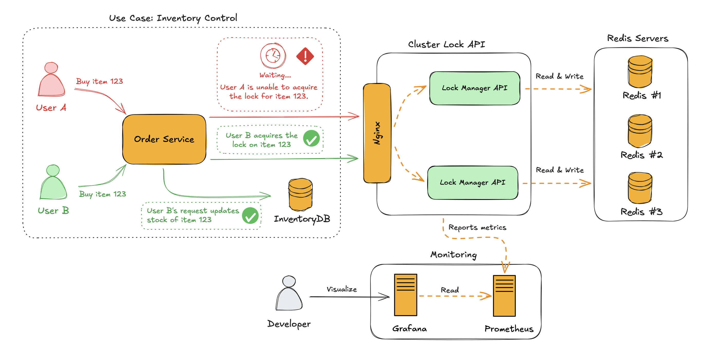

# Serviço de Gerenciamento de Lock Distribuído

### Introdução
Um Serviço de Lock Distribuído é um mecanismo projetado para coordenar o acesso a recursos compartilhados em sistemas distribuídos. Ele garante que múltiplos processos, serviços ou sistemas não acessem simultaneamente uma seção crítica de código ou dados, prevenindo inconsistências e corrupção de dados.

Em sistemas distribuídos, onde recursos são compartilhados entre diferentes nós, garantir a exclusividade no acesso a certos recursos é essencial para a consistência e integridade dos dados.

### Propósito
O principal objetivo de um serviço de lock distribuído é garantir exclusão mútua em ambientes distribuídos. Isso significa que apenas um processo pode possuir o lock para um determinado recurso em um momento específico.

**Benefícios**:
1. **Consistência**: Evita condições de corrida (race conditions), garantindo que apenas uma entidade acesse um recurso de cada vez.
2. **Tolerância a Falhas**: Lida com falhas de nós ou processos, liberando locks de forma segura quando necessário.
3. **Escalabilidade**: Permite operações seguras em sistemas com milhares de nós e serviços concorrentes.
4. **Durabilidade**: Os locks podem ser configurados para sobreviver a reinicializações, dependendo da arquitetura utilizada.

### Funcionalidades do Serviço de Lock Distribuído
Este projeto implementa um serviço de lock distribuído utilizando Redis como backend, aproveitando sua capacidade de executar operações atômicas e notificações de eventos.

#### Principais Funcionalidades:
1. **Aquisição de Locks**:

- Clientes podem adquirir um lock em um recurso específico por um período de tempo definido (TTL).
- Suporte para retries automáticos com backoff exponencial.

2. **Liberação de Locks**:

- Locks podem ser liberados explicitamente ou expirar automaticamente.

3. **Renovação de Locks**:

- Permite estender o tempo de vida (TTL) de um lock ativo para evitar expiração durante operações críticas.

4. **Alta Disponibilidade**:

- Funciona com clusters Redis para maior tolerância a falhas e escalabilidade.

### Arquitetura

#### Componentes:
1. **Redis**:

- Armazena o estado dos locks.
- Utiliza operações atômicas como SETNX e EXPIRE para gerenciar os locks.

2. **Serviço de API de Lock**:

- Exponibiliza endpoints HTTP para aquisição, liberação e renovação de locks.
- Implementado em Go e projetado para ser stateless.

3. **Clientes**:

- Consumidores interagem com o serviço usando o SDK ou diretamente via HTTP.

### Instalação e Configuração
#### Pré-requisitos:
1. **Docker**: Para executar o Redis e o serviço de lock.
2. **Go**: Para compilar e executar o código.

#### Passos para Instalação:
1. Clone o repositório:

``` bash
git clone https://github.com/Waelson/lock-manager-service.git
cd lock-manager-service
```

2. Execute os serviços com Docker Compose:

``` bash
docker-compose up --build
```

3. Verifique se o serviço do cliente está rodando:

``` bash
curl -X POST -H "Content-Type: application/json" -d '{"item_name": "item1", "quantity": 1}' http://localhost:9090/order
```

### Testes de Carga
O projeto inclui um **script de teste de carga** para avaliar a eficiência do serviço. Ele realiza múltiplas requisições simultâneas para simular cenários de uso real.

#### Localização do Script:
O script está disponível no diretório raiz do projeto com o nome `run_requests.sh`.

#### Principais Características:
- Realiza múltiplos lotes de requisições simultâneas.
- Exibe uma barra de progresso e um sumário das requisições bem-sucedidas e com erro.
- Gera um log (responses.log) com o resultado de cada requisição.


#### Como Executar:
1. Torne o script executável:

``` bash
chmod +x run_requests.sh
```

2. Execute o script:

``` bash
./run_requests.sh
```

3. Verifique o progresso no terminal e os resultados no arquivo `responses.log`.

#### Exemplo de Saída:

``` bash
[###############################                ] 70% (70/100) | Successful: 690 | Failed: 10
```